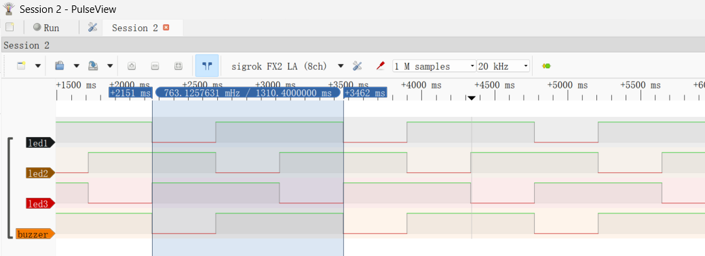

# 有源蜂鸣器
项目核心目标实现对stm32f103c8t6的通用IO控制。
并搭建出基本的软件框架，对软件进行分层。后续项目将复用此框架。
使用核心板的GPIO，有源蜂鸣器。预期现象为实现控制有源蜂鸣器的发声与停止。
同时注意，本项目未对芯片的时钟进行配置，系统时钟使用的实际是HSI。
## 硬件
### 模块详情
有源蜂鸣器模块，链接为[有源蜂鸣器链接](https://item.taobao.com/item.htm?spm=a21n57.1.item.4.1d1a523crI0r4Y&priceTId=214781c517233646521527775ef565&utparam=%7B%22aplus_abtest%22:%226617f02a2483d51a12666422aaaaa6ed%22%7D&id=522572589576&ns=1&abbucket=7)

实物图如：


预期现象如图：



控制方式：

因为有源蜂鸣器内部集成了RC震荡电路，所以只需要对**I/O**引脚给高低电平就可以控制蜂鸣器的发声。对于有源蜂鸣器，其缺点是因为震荡频率无法外部控制，仅能简单的控制开关。

电路连接：

```
VCC[buzzer] <------> VCC
GND[buzzer] <------> GND
I/O[buzzer] <------> PB1
```

## 软件
程序部分在0.0-led的基础上，对代码进行分层，并对目录布局进行修改。新的代码文件放置方式如:
```shell
.
├── app     #应用层逻辑，main函数入口
├── board   #描述板级的代码文件，主要是将应用层的逻辑转换到寄存器操作
├── chip    #描述stm32f103c8t6芯片的代码文件，主要是各种寄存器相关的定义和接口
├── debug   #中间文件和目标文件
├── img     #图片保存目录
└── startup #启动汇编文件+链接脚本，复制自0.0-led
```

同时修改Makefile适配新的文件布局。