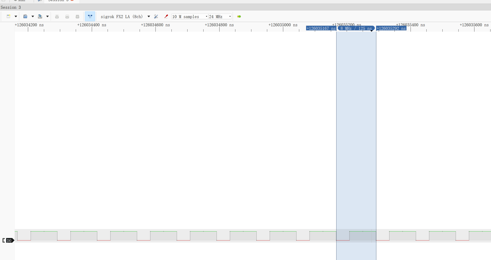

# MCO 微控制器时钟输出 (Microcontroller clock output)

MCO是stm32芯片带的一种外设，可以将芯片内部的时钟输出到外部。可选的输出模式有HSI、HSE、SYSCLK、PLL/2，四种。
使用时，需要将A8引脚配置为AFIO推挽输出，速度50M。正确配置MCO功能后，然后就可以在A8口看到选中的时钟信号了。
对比之前的内容，这次对MCO的设置对HSE进行了比较完整的设置，在外接8M晶振的情况下，将系统主频提高到72M。同时，首次利用了stm32的IO复用，将引脚复用到外设。
预期现象，本项目预期能够通过A8引脚输出芯片内部时钟。

实际输出效果见

这里只展示了HSE输出的情况(HSI的现象是一样的)，更高频率的输出超过了我手头逻辑分析仪的能力。