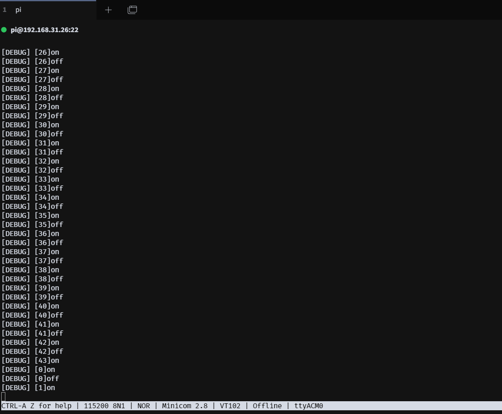
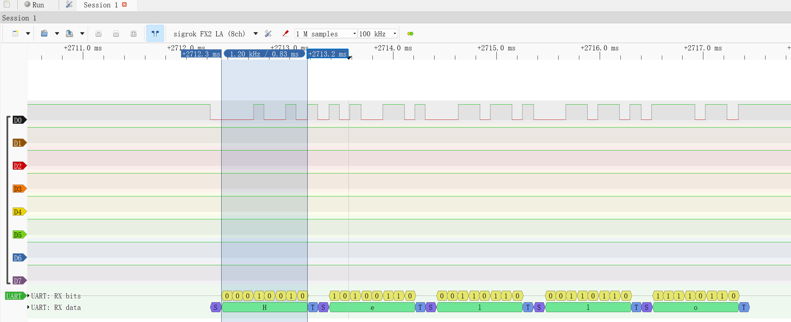
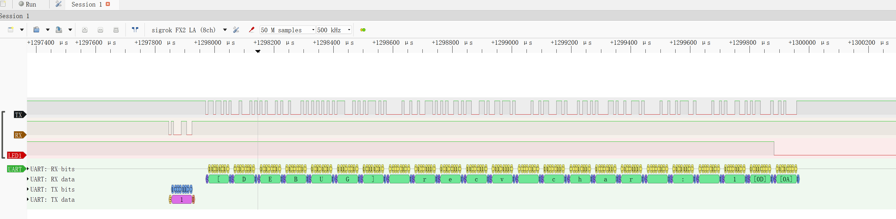
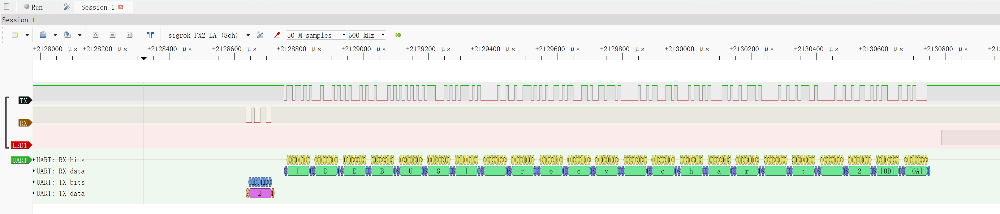
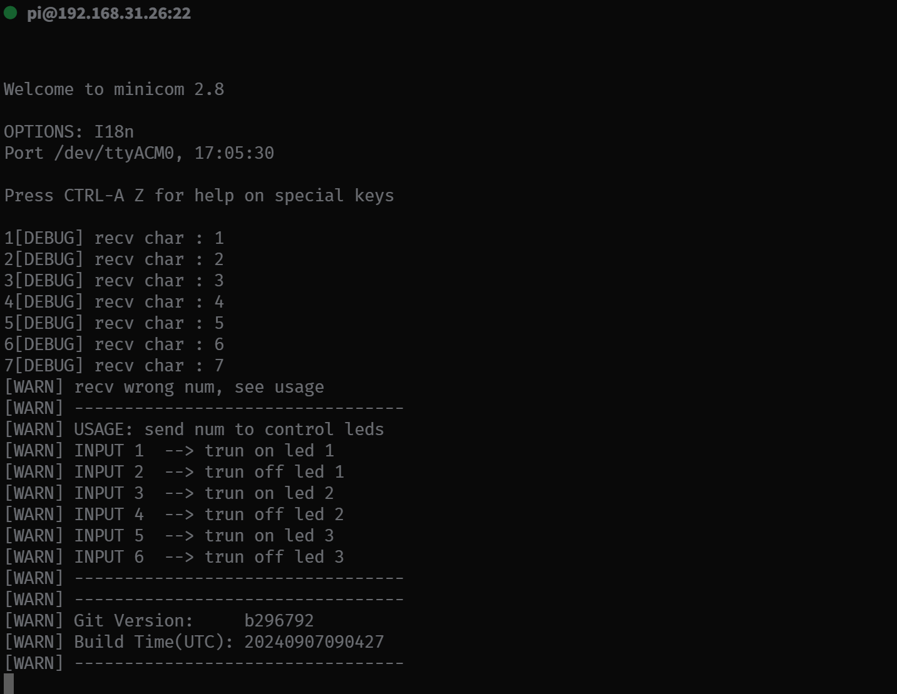

# UART
为了方便调试，考虑尽快完成串口的功能的控制。

## 功能说明
本例中，使用了板载的UART1外设，设置了波特率115200，采用阻塞式的输入输出方式，最终实现了简单的通过RX收到特定的字符后可以控制板载三个LED的控制。

引脚连接如：
```
PA9[UART1 TX] <------> USB2UART RX
PA10[UART1 RX] <------> USB2UART TX
GND<------> GND
```

以及一个简单的日志打印功能可以输出日志方便调试。

uart打印的过程如：





可以通过上位机的TX向核心板UART1的RX发送特定的控制字符来控制LED的开关，如：





当收到特定控制字符外的其他字符，会打印出usage和version信息，如：



## 软件修改说明

对比上一个例子，本例中需要指出的修改说明有：

1. 本例中使用了对uart的输入输出均使用了阻塞式的写法，这样比较简单，但是效率很低，后续会通过中断来读。

2. 制作了一个简单的通用应用层日志打印模块，因为需要使用到**vsnprintf()** ，还需要使用newlib来支持，修改了Makefile链接到newlib-nano，同时为了适配newlib，在syscalls.c中实施了一些系统调用的占位。

3. 修改了Makefile，在编译时将编译时对应的git commit号与编译时间通过宏传递到代码，并给了打印的方法，这样方便问题追溯。
